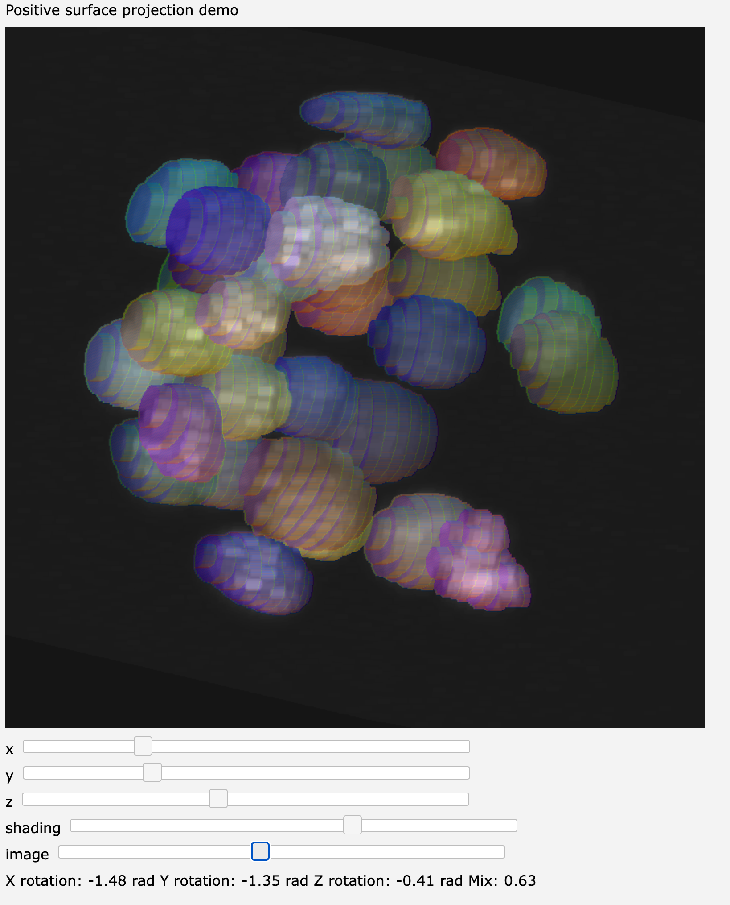

# resample3
Special purpose python extension for resampling and projecting volume data.



## To install

```bash
pip install resample3
```

## Build

```bash
python -m pip install -e .
```

## Test

```bash
python -m pip install pytest numpy
pytest -q
```

## Demos

The demos require additional libraries.

```bash
pip install resample3[demos]
```


